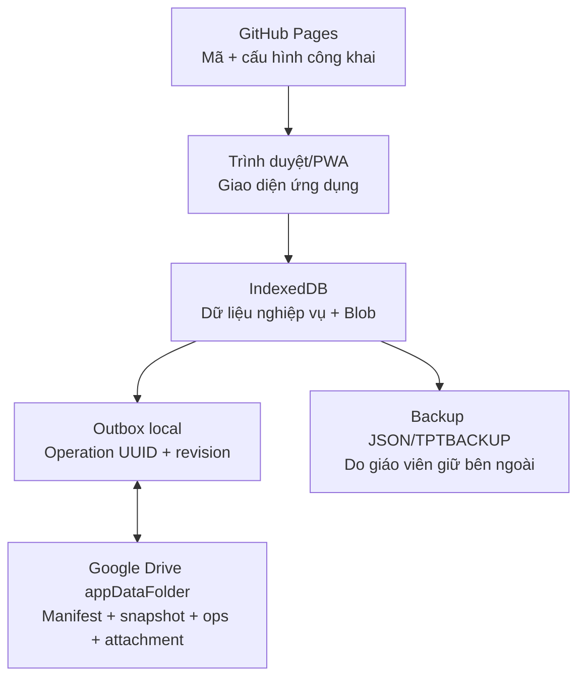

# Sơ đồ lưu trữ và luồng dữ liệu

| Nơi | Có gì | Không có gì | Vai trò |
|---|---|---|---|
| GitHub repository/Pages | HTML, JS, PWA, icon, tài liệu, Client ID công khai, email hash | Hồ sơ thật, backup, token, client secret | Phát hành cùng một URL cho giáo viên |
| IndexedDB trên từng thiết bị | Bảng nghiệp vụ, revision, tombstone, outbox, snapshot local, Blob | Token Drive lâu dài | Kho làm việc chính, chạy offline |
| localStorage | Device ID, cờ ghép Drive, tùy chọn rất nhỏ | Bảng nghiệp vụ, token, trạng thái mở khóa | Hỗ trợ phiên/thiết bị |
| Bộ nhớ JavaScript | Trạng thái mở khóa và access token ngắn hạn | Dữ liệu bền vững | Chỉ tồn tại đến reload/đóng phiên |
| Drive `appDataFolder` | Manifest, snapshot, journal theo lô, attachment checksum | Mã web, client secret, dữ liệu Gmail khác | Đồng bộ hai chiều riêng theo Gmail/OAuth app |
| Backup bên ngoài | Gói nhanh/đầy đủ/năm học, có checksum/mã hóa tùy chọn | Không nên đặt trong GitHub | Phục hồi khi mất local/quyền/Drive |

## Trình tự một lần ghi

1. Kiểm tra dữ liệu và quyền sửa năm học/tab.
2. Ghi bản ghi và operation outbox trong cùng transaction IndexedDB.
3. Chỉ sau `transaction.oncomplete` mới báo đã lưu trên thiết bị.
4. Khi có mạng + token + đã ghép, đọc nhật ký Drive trước.
5. Xác minh App ID/school ID/namespace/schema/checksum.
6. Áp thay đổi không xung đột; đưa xung đột vào màn hình xử lý.
7. Gom tối đa 100 operation thành lô bất biến và tải lên bằng tên idempotent.
8. Đọc lại lô/manifest để xác nhận rồi mới báo đã đồng bộ.

GitHub không phải cơ sở dữ liệu. Google Drive không thay thế backup ngoài. `admin@` không mã hóa dữ liệu local; bảo vệ thiết bị vẫn phụ thuộc khóa màn hình/hồ sơ trình duyệt của giáo viên.
